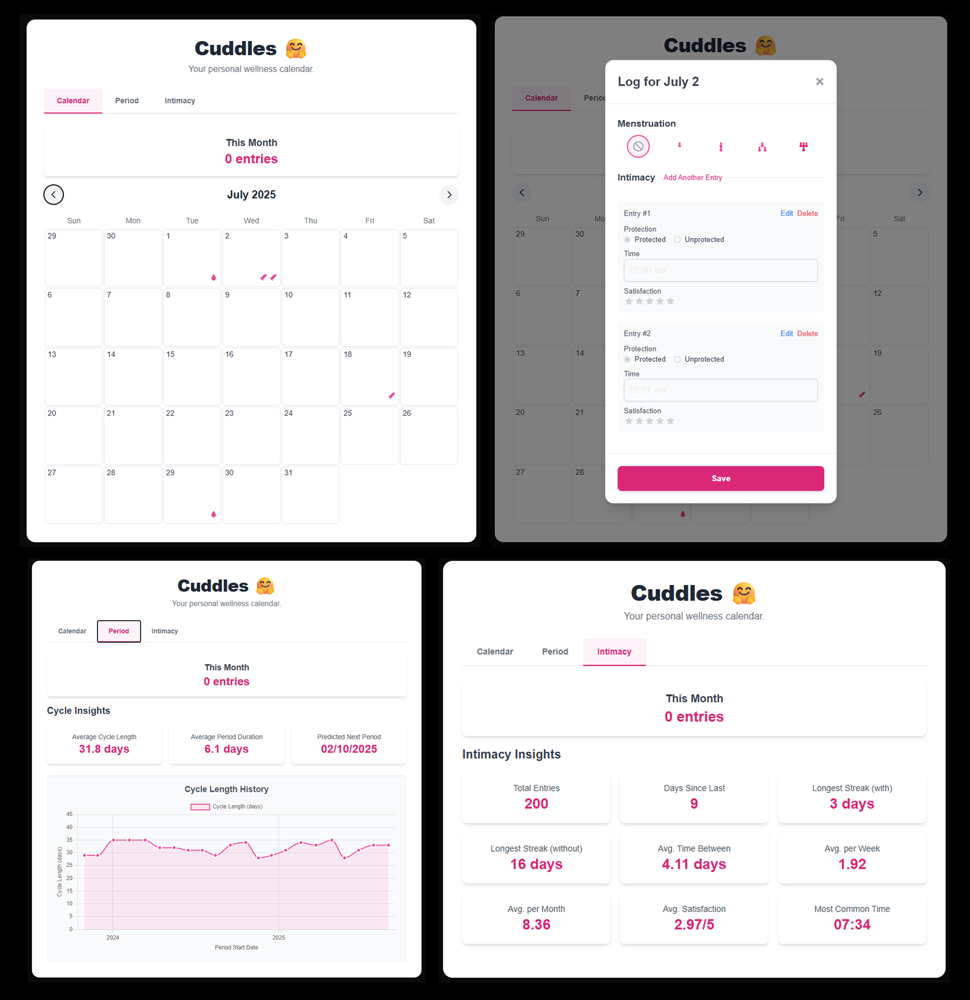

# Cuddles 🤗 - Progressive Web App for Period & Intimacy Tracking# Cuddles 🤗 - Open Source Period and Intimacy Tracker


Your open-source, self-hosted, cross-browser compatible PWA for period and intimacy tracking—take complete control of your health data! Cuddles is a privacy-first alternative to apps like Flo, built with modern web technologies and designed to work seamlessly across all devices and browsers.Your open-source, self-hosted period and sex tracking app—take control of your data! Cuddles is a privacy-first alternative to apps like Flo, built with a modern tech stack and customizable code. Track your cycles, analyze stats, and get personalized predictions, all while owning your data.





## 🌟 Why Cuddles?## Why Cuddles?


Cuddles was born from a desire to give users freedom and control over their sensitive health data. Unlike corporate apps where data is locked away and features are paywalled, Cuddles is:Cuddles was born from a desire to give users freedom and control over their sensitive health data. Unlike corporate apps like Flo, where data is locked away and some features are paywalled, Cuddles is open-source, self-hosted, and endlessly customizable. Whether you're a user seeking a better tracking experience or a developer wanting to tweak features, Cuddles is for you!


- **🔒 Privacy-First**: All data stored locally, no external tracking## Features

- **📱 Cross-Platform**: Works on iOS, Android, Windows, macOS, Linux

- **🌐 Cross-Browser**: Compatible with Chrome, Firefox, Safari, Edge* **Period & Sex Tracking** : Log your cycles and intimate moments with ease.

- **💻 Self-Hosted**: You own your data and infrastructure* **Cycle Analysis** : Understand your patterns with insightful stats.

- **🎨 Customizable**: Open-source and endlessly configurable* **Period Prediction** : Get smart predictions to stay ahead of your cycle.

- **📶 Offline-Ready**: Works without internet connection* **Web Push Notifications** : Stay updated (note: not supported on iOS due to platform limitations).

* **PWA Support** : Use Cuddles as a Progressive Web App for a seamless mobile experience.

## ✨ Features* **Daily Database Backups** : Automatically back up your SQLite database daily with configurable retention (production only).


### Core Functionality## Tech Stack

- **📅 Period & Intimacy Tracking**: Log cycles and intimate moments with ease

- **📊 Cycle Analysis**: Understand patterns with insightful statistics

- **🔮 Period Prediction**: Smart predictions to stay ahead of your cycle

- **📱 Progressive Web App**: Install on any device for native app experience


### PWA Features

- **📲 Cross-Browser Installation**: Install on any browser/device## Status

- **🔔 Push Notifications**: Period reminders (Chrome, Firefox, Edge, Android)

- **📶 Offline Support**: Full functionality without internetCuddles is in  **beta** —it’s experimental, and some features may need polishing. We’re excited to invite issues and pull requests to make it even better!

- **🔄 Background Sync**: Automatic data sync when connection returns

- **🏠 App Shortcuts**: Quick actions from home screen## Installation

- **⚡ Smart Caching**: Lightning-fast loading with intelligent cache strategies

Get Cuddles running on your server or local machine in minutes with Docker Compose.

### Advanced Features

- **🔐 VAPID Push Notifications**: Secure web push notifications### Prerequisites

- **💾 Daily Database Backups**: Automatic SQLite backups with configurable retention

- **🔍 Lighthouse PWA Score**: 100% PWA compatibility* [Docker](https://www.docker.com/get-started) and [Docker Compose](https://docs.docker.com/compose/install/) installed.

- **🌙 Network-Aware**: Graceful offline/online transition handling* [Node.js](https://nodejs.org/) installed locally (for generating VAPID keys).

* [Python](https://www.python.org/) installed locally (for data ingestion scripts).

## 🛠️ Tech Stack* A reverse proxy (optional, for server deployment): [Caddy](https://caddyserver.com/), [Traefik](https://traefik.io/), or [Nginx](https://nginx.org/).


### Setup for Production


1. **Clone the repo** :


```bash

   git clone https://github.com/your-username/cuddles.git

   cd cuddles

```


**Frontend**: Next.js 14, React 18, TypeScript, Tailwind CSS, Service Workers1. **Generate VAPID keys** for web push notifications:

**Backend**: Flask 3.0, Python 3.11, SQLite, VAPID Push Notifications   Install the `web-push` library temporarily:

**Infrastructure**: Docker Compose, Health Checks, Automated Backups

**PWA**: Service Worker, Web App Manifest, Push API, Background Sync   ```bash

   npm install web-push

## 🚀 Quick Start   ```


### Prerequisites   Run this script to generate keys:


- [Docker Desktop](https://www.docker.com/get-started) installed and running   ```javascript

- [Node.js](https://nodejs.org/) (for VAPID key generation)   const webpush = require('web-push');

- [Git](https://git-scm.com/) for cloning the repository   const vapidKeys = webpush.generateVAPIDKeys();

   console.log('Public Key:', vapidKeys.publicKey);

### 🏃‍♂️ Development Setup   console.log('Private Key:', vapidKeys.privateKey);

   ```

1. **Clone the repository**:

   ```bash   Save the output securely. Uninstall `web-push` afterward:

   git clone https://github.com/your-username/cuddles.git

   cd cuddles   ```bash

   ```   npm uninstall web-push

   ```

2. **Generate VAPID keys** (for push notifications):2. **Create and edit the `.env` file** :

   ```bash   Copy the example environment file:

   npm install web-push

   node -e "```bash

   const webpush = require('web-push');   cp .env.example .env

   const keys = webpush.generateVAPIDKeys();```

   console.log('VAPID_PUBLIC_KEY=' + keys.publicKey);

   console.log('VAPID_PRIVATE_KEY=' + keys.privateKey);   Edit `.env` with your preferred settings. Required variables:

   "

   npm uninstall web-push* `VAPID_PUBLIC_KEY`: Your generated VAPID public key (from step 2).

   ```* `VAPID_PRIVATE_KEY`: Your generated VAPID private key (from step 2).

* `VAPID_EMAIL`: An email address for push service providers (e.g., `you@example.com`).

3. **Create environment file**:* Optional variables (defaults shown):

   ```bash* `NOTIFICATION_HOUR=11`: Hour for daily notifications (24-hour format).

   cp .env.example .env* `NOTIFICATION_MINUTE=0`: Minute for daily notifications.

   # Edit .env with your VAPID keys and email* `TZ=Asia/Singapore`: Timezone for the app and backups.

   ```* `BACKUP_RETENTION_DAYS=7`: Days to retain database backups (stored in `./instance/backups`).


4. **Start development environment**:  Example `.env`:

   ```bash

   ./scripts/dev.sh```

   ```   VAPID_PUBLIC_KEY=your_vapid_public_key_here

   VAPID_PRIVATE_KEY=your_vapid_private_key_here

5. **Open in browser**:   VAPID_EMAIL=you@example.com

   - UI: http://localhost:3000   NOTIFICATION_HOUR=11

   - API: http://localhost:8500   NOTIFICATION_MINUTE=0

   TZ=Asia/Singapore

### 🌐 Production Deployment   BACKUP_RETENTION_DAYS=7

```

1. **Follow steps 1-3 from development setup**

1. **Start the server** :

2. **Deploy to production**:   Use the deployment script for easy setup:

   ```bash

   ./scripts/deploy.sh   ```bash

   ```   ./deploy.sh

   ```

3. **Access your application**:

   - UI: http://localhost:3000   Or manually:

   - API: http://localhost:8500

   ```bash

## 📱 PWA Installation Guide   docker-compose build --no-cache && docker-compose up -d

   ```

### For Users

1. **Access Cuddles** :

#### 📱 iOS (iPhone/iPad)

1. Open Cuddles in Safari* **UI** : `http://localhost:3000`.

2. Tap the Share button (📤)* **API** : `http://127.0.0.1:8500` (for developer integrations).

3. Scroll down and tap "Add to Home Screen"* **Backups** : Daily SQLite database backups are saved to `./instance/backups` with logs in `./instance/backups/backup.log`.

4. Tap "Add" to install

1. **Optional: Server Deployment** :

#### 🤖 Android   For public access, configure a reverse proxy (Caddy, Traefik, or Nginx) to route traffic to `http://localhost:3000` (UI) and `http://127.0.0.1:8500` (API). Ensure HTTPS is enabled for security.

1. Open Cuddles in Chrome

2. Look for the "Install App" prompt### Setup for Development

3. Tap "Install" when prompted

4. Or use Chrome menu → "Add to Home screen"To develop Cuddles locally with hot reloading and debug modes, use the dedicated `docker-compose.dev.yml` file, which uses development-specific Dockerfiles for the API (`flask run`) and UI (`next dev`).


#### 💻 Desktop (Chrome/Edge)1. **Clone the repo** (if not already done):

1. Open Cuddles in your browser   ```bash

2. Look for the install icon in the address bar   git clone https://github.com/your-username/cuddles.git

3. Click the install button   cd cuddles

4. Follow the installation prompts   ```

2. **Generate VAPID keys** (if not already done):

### For Developers   Follow the production VAPID key generation steps above using `web-push`.

3. **Create and edit the `.env` file** :

#### 🧪 PWA Testing   Copy the example environment file:

```bash

# Interactive PWA testing across browsers and environments```bash

./scripts/test-pwa-interactive.sh   cp .env.example .env

```

# Comprehensive PWA compatibility check

./scripts/pwa-cross-browser-check.sh   Edit `.env` with the same variables as production:

```

* Required: `VAPID_PUBLIC_KEY`, `VAPID_PRIVATE_KEY`, `VAPID_EMAIL`.

#### 🔍 PWA Development Tools* Optional: `NOTIFICATION_HOUR`, `NOTIFICATION_MINUTE`, `TZ` (defaults to `Asia/Singapore`).

- **Chrome DevTools**: Application → Service Workers, Manifest* Note: `BACKUP_RETENTION_DAYS` is ignored in development unless the backup service is enabled.

- **Lighthouse**: Run PWA audit for 100% score

- **Firefox DevTools**: Application → Service Workers  Example `.env`:

- **Safari Web Inspector**: Storage → Service Workers

```

## 📁 Scripts Reference   VAPID_PUBLIC_KEY=your_vapid_public_key_here

   VAPID_PRIVATE_KEY=your_vapid_private_key_here

All scripts are located in the `./scripts/` directory:   VAPID_EMAIL=you@example.com

   NOTIFICATION_HOUR=11

| Script | Purpose | Usage |   NOTIFICATION_MINUTE=0

|--------|---------|-------|   TZ=Asia/Singapore

| `dev.sh` | Start development environment | `./scripts/dev.sh` |```

| `deploy.sh` | Deploy to production | `./scripts/deploy.sh` |

| `test-pwa-interactive.sh` | Interactive PWA testing | `./scripts/test-pwa-interactive.sh` |1. **Ensure UI dependencies** :

| `pwa-cross-browser-check.sh` | PWA compatibility check | `./scripts/pwa-cross-browser-check.sh` |   In the `./ui` directory, ensure a `package.json` exists with a `dev` script for Next.js. Example:

| `backup.sh` | Manual database backup | `./scripts/backup.sh` |

```json

## 🔧 Development Workflow   {

     "scripts": {

### Environment Variables       "dev": "next dev"

     },

```bash     "dependencies": {

# Required for push notifications       "next": "^14.2.0"

VAPID_PUBLIC_KEY=your_public_key_here     }

VAPID_PRIVATE_KEY=your_private_key_here   }

VAPID_EMAIL=your-email@domain.com```


# Optional configuration   If missing, install Next.js:

NOTIFICATION_HOUR=11

NOTIFICATION_MINUTE=0```bash

TZ=Asia/Singapore   cd ui

BACKUP_RETENTION_DAYS=7   npm install next

```

# PWA Development (optional)

HTTPS=true  # Enable HTTPS for full PWA testing1. **Generate or ingest sample data** :

```   To populate the SQLite database (`./instance/menses.db`) with fake data or import data from Flo-exported text files:


### Testing Notifications* Install required Python packages:


```bash  ```bash

# Test different notification types  pip install faker requests tqdm

curl "http://localhost:8500/test-push?type=period"  ```

curl "http://localhost:8500/test-push?type=ovulation"* Start the development server to ensure the API is running:

curl "http://localhost:8500/test-push?type=generic"

```  ```bash

  ./dev.sh

### Data Ingestion  ```

* **Generate fake data** :

```bash  ``bash python ingest_data.py --fake [--num-period-cycles <int>] [--num-sex-entries <int>] ``

# Generate fake data for testing

python scripts/ingest_data.py --fake --num-period-cycles 20 --num-sex-entries 50  * Generates fake data for October 2023 to October 2025.

    *`--num-period-cycles`: Number of period cycles (each with `period_start` and `period_end`, default: 20).

# Import from Flo export  * `--num-sex-entries`: Number of sex entries (default: 50).

python scripts/ingest_data.py --file path/to/flo_export.txt  * Example: `python ingest_data.py --fake --num-period-cycles 10 --num-sex-entries 30` (generates 10 cycles = 20 period entries, 30 sex entries).

* **Ingest from Flo-exported file** :

# Dry run (preview without importing)  ``bash python ingest_data.py --file path/to/flo_export.txt ``

python scripts/ingest_data.py --fake --dry-run

```  * The text file should contain mixed `Period` and `Sex` entries in the format:

    ``     123 - 2025-01-01 08:00:00.0 - Period Start - flow: light - symptoms: cramps, fatigue - notes: Feeling okay        124 - 2025-01-04 08:00:00.0 - Period End - flow: medium - pain: 3        1671 - 2025-01-13 14:00:00.0 - Sex - protected - satisfaction: 4 - time_of_day: 14:00     ``

## 🌐 Browser Compatibility* **Dry run** (print payloads without posting):


| Feature | Chrome | Firefox | Safari | Edge | Mobile |  ```bash

|---------|--------|---------|--------|------|--------|  python ingest_data.py --fake --dry-run

| PWA Install | ✅ | ✅ | ✅ | ✅ | ✅ |  python ingest_data.py --file path/to/flo_export.txt --dry-run

| Service Worker | ✅ | ✅ | ✅ | ✅ | ✅ |  ```

| Push Notifications | ✅ | ✅ | ❌* | ✅ | ✅ |* This populates `./instance/menses.db` via API calls to `http://127.0.0.1:8500/api/entries`. Ensure the API server is running before executing the script.

| Background Sync | ✅ | ⚠️ | ❌* | ✅ | ✅ |

| Offline Caching | ✅ | ✅ | ✅ | ✅ | ✅ |1. **Start the development server** :

| App Shortcuts | ✅ | ⚠️ | ❌* | ✅ | ✅ |   Use the development script for easy setup:


*\* Safari limitations due to Apple's PWA restrictions*   ```bash

   ./dev.sh

## 🔍 PWA Architecture   ```


### Service Worker Features   Or manually:

- **Multi-Strategy Caching**: Cache-first for assets, network-first for APIs

- **Smart Updates**: Automatic service worker updates with user control   ```bash

- **Offline Fallback**: Custom offline page with network status detection   docker-compose -f docker-compose.dev.yml build --no-cache && docker-compose -f docker-compose.dev.yml up -d

- **Background Sync**: Queue requests when offline, sync when online   ```

- **Push Notifications**: Cross-browser VAPID implementation

1. **Access Cuddles** :

### Performance Optimizations

- **Cache Versioning**: Automatic cache cleanup and updates* **UI** : `http://localhost:3000` (hot reloading enabled for Next.js changes).

- **Network Detection**: Online/offline status monitoring* **API** : `http://127.0.0.1:8500` (Flask debug mode with auto-reloading).

- **Smart Loading**: Stale-while-revalidate for optimal performance

- **Compression**: Optimized asset delivery1. **Make changes** :


## 🐛 Troubleshooting* Edit UI code in the `./ui` directory; `next dev` reflects changes instantly.

* Edit API code in the `./app` directory; `flask run` reloads on save.

### Common Issues* Use the SQLite database in `./instance` for testing (not backed up by default).


#### PWA Not Installing1. **Enable backups (optional)** :

1. Ensure HTTPS is enabled (production) or use localhost   To enable daily database backups in development, uncomment the `backup` service in `docker-compose.dev.yml` and set `BACKUP_RETENTION_DAYS` in `.env`. Backups will be saved to `./instance/backups`.

2. Check Service Worker registration in DevTools2. **Troubleshoot issues** :

3. Verify manifest.json is accessible

4. Run `./scripts/pwa-cross-browser-check.sh`* **API issues** :

  * Check API logs: `docker logs cuddles_api_1`.

#### Push Notifications Not Working  * Verify API is running: `curl http://127.0.0.1:8500/api/stats/sex`.

1. Check VAPID keys in .env file  * If `ingest_data.py` fails, check error messages for payloads and status codes.

2. Verify notification permissions in browser* **UI issues** (e.g., Sex entries not displaying):

3. Test with `curl "http://localhost:8500/test-push?type=period"`  * Check UI logs: `docker logs cuddles_ui_1`.

4. iOS Safari doesn't support push notifications  * Rebuild UI image: `docker-compose -f docker-compose.dev.yml build ui`.

  * Ensure `package.json` in `./ui` has `next` and a `dev` script.

#### Service Worker Issues  * Verify Sex entries in database: `sqlite3 ./instance/menses.db "SELECT * FROM sex;"`.

1. Clear browser cache and reload  * Check UI data fetching logic for issues with `/api/entries` or filtering `entry_type: "sex"`.

2. Check DevTools → Application → Service Workers  * Ensure `time_of_day` is in `HH:MM` format (e.g., `14:22`) and `protected` is `"protected"` or `"unprotected"`.

3. Unregister and re-register service worker* **Data ingestion issues** :

4. Check console for error messages  * Ensure the Flo-exported text file matches the expected format (see step 5).

  * Use `--dry-run` to debug payloads: `python ingest_data.py --file path/to/flo_export.txt --dry-run`.

### Development Tools

## Usage

```bash

# View container logsOnce running, open `http://localhost:3000` in your browser to access the Cuddles UI. Log periods, track intimate moments, and explore cycle stats via the intuitive interface. Developers can interact with the Flask API at `http://127.0.0.1:8500` for custom integrations (e.g., `GET /api/stats/sex` for stats).

docker-compose -f docker-compose.dev.yml logs -f

## Contributing

# Check container status

docker-compose -f docker-compose.dev.yml psCuddles is a community-driven project, and we welcome your help! Found a bug? Have a feature idea? Please:


# Restart services* Open an issue on [GitHub Issues](https://github.com/your-username/cuddles/issues).

docker-compose -f docker-compose.dev.yml restart* Submit pull requests with improvements or new features.


# Clean rebuild **Ideas for Contributions** :

docker-compose -f docker-compose.dev.yml down

docker-compose -f docker-compose.dev.yml build --no-cache* Add new features like advanced cycle analytics or UI themes.

docker-compose -f docker-compose.dev.yml up -d* Add advanced notification alerts

```* Native Mobile App Experience

* Offline Support

## 📚 Documentation

## License

- [PWA Cross-Browser Guide](./PWA-CROSS-BROWSER-GUIDE.md) - Comprehensive PWA implementation details

- [API Documentation](./API.md) - REST API referenceTBD (a permissive license like MIT will be chosen soon—stay tuned!).

- [Contributing Guide](./CONTRIBUTING.md) - How to contribute to Cuddles

## Acknowledgments

## 🤝 Contributing

Cuddles was inspired by my wife’s experience with Flo, where data is locked away and premium features come at a cost. This project is dedicated to her and to everyone who wants a free, open, and customizable way to track their health.

Cuddles is a community-driven project! We welcome contributions:

## Get Involved!

### Ways to Contribute

- 🐛 **Bug Reports**: Open issues for bugs or problemsLove Cuddles? Give us a ⭐ on GitHub and join the journey to make period and sex tracking open and accessible for all! Have feedback? Drop it in [GitHub Issues](https://github.com/your-username/cuddles/issues).

- 💡 **Feature Requests**: Suggest new features or improvements
- 🔧 **Code Contributions**: Submit pull requests with fixes or features
- 📖 **Documentation**: Improve docs, guides, and examples
- 🧪 **Testing**: Test on different browsers and devices

### Development Ideas
- 🎨 **UI/UX Improvements**: Better design and user experience
- 📱 **Mobile Features**: Enhanced mobile PWA experience
- 🔔 **Notification Enhancements**: Advanced reminder systems
- 📊 **Analytics**: More detailed cycle analysis and insights
- 🌍 **Internationalization**: Multi-language support
- 🔗 **Integrations**: Health app integrations, export features

## 📄 License

This project is licensed under the [MIT License](./LICENSE) - see the LICENSE file for details.

## 🙏 Acknowledgments

Cuddles was inspired by the need for a privacy-first, user-controlled alternative to commercial period tracking apps. This project is dedicated to everyone who values data ownership and open-source health technology.

Special thanks to:
- The open-source community for amazing tools and libraries
- Privacy advocates who fight for user data rights
- Everyone who contributes to making healthcare technology more accessible

## 🌟 Support

Love Cuddles? Here's how you can help:

- ⭐ **Star this repository** on GitHub
- 🐛 **Report bugs** and suggest features
- 🔗 **Share with friends** who value privacy
- 💻 **Contribute code** or documentation
- 📝 **Write about Cuddles** in blogs or social media

---

**Get started today**: Clone, configure, and deploy your own private health tracking PWA in minutes! 🚀